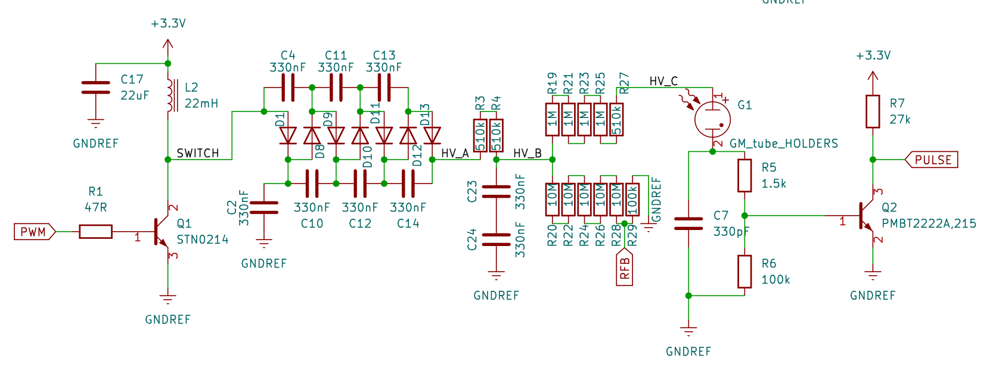
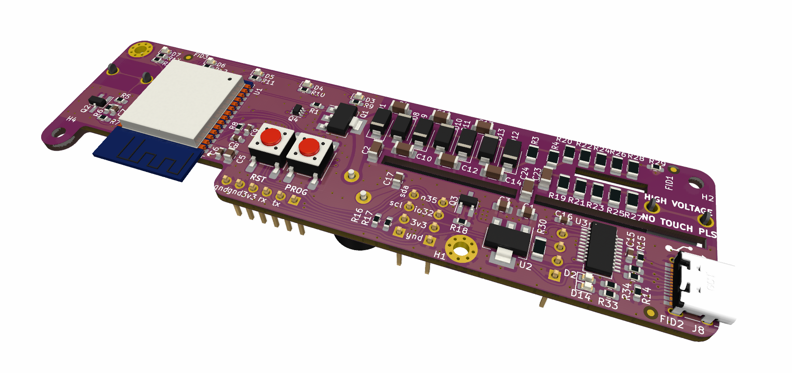

# EIKGEIGER


Eikgeiger opensource project for detection of background radiation in Norway. It is developed in cooperation with Eik Ideverksted. Use the design for anything you like comercially and privately, but i would love if you fork it so i can see what it is used for.

## First Batch
Thanks to [PCBway](www.pcbway.com) for providing assembled prototype boards for this project. Its awesome that you support the opensource community like this! If you want one for yourself, i've made a [pcbway project](https://www.pcbway.com/project/shareproject/EikGeiger_IOT_Geigercounter_60bd1e1f.html) which you can make an assembly order quite easily. 


## Description
It uses an[ESP32-WROOM-32E](./DOCUMENTATION/esp32-wroom-32e_esp32-wroom-32ue_datasheet_en.pdf) wifi module both communication and MCU, and is mostly based on surface mount components.

Thanks to the DIYgeiger radmon project for inspiration [DIYGeiger RADMON + kit](https://sites.google.com/site/diygeigercounter/home/gk-radmon).

If you want to handsolder this, i really recommend to check out the awesome IBOM assembly utility (use it with a desktop as it sucks on mobile)
[Assembly IBOM](https://htmlpreview.github.io/?https://raw.githubusercontent.com/fredriknk/eikgeiger/main/PRODUCTION/ibom.html)

[SCHEMATIC](./DOCUMENTATION/Opengieger_schematic.pdf)
## Specifications
| **Parameter**     | **Description**                                                     |
|-------------------|---------------------------------------------------------------------|
| _Input voltage_   | Usb-C cable, Header 4-6v, Direct 3.3v                               |
| _Current_         | Wifi: 150-250mA, Radio Off: 44mA, Only HV psup 4mA, Deep sleep 70uA |
| _Communication_   | 2.4ghz WIFI, Uart TTL, Uart over USB                                |
| _Baudrate_        | 115200                                                              |
| _PCB size_        | 31x119mm                                                            |
| _Case size_       | 30x35x121mm                                                         |
| _Series Resistor_ | 4.51MOHM                                                         |

## Serial port controll comands

To reconfigure device settings you need to connect the eikgeiger to a computer with a serial terminal (I reccomend to just use the [Arduino Program](https://www.arduino.cc/en/software), but any serial terminal should work)

When you want to configure a value you use two characters plus a number. So to set the PWM frequency to 2000hz, you would write PF2000 in the terminal and send. Some commands need a specific number, eg to factory reset you must transmit FR9999. after you have verified that the configuraion works you use SA1 to save the config to the flash eeprom

| **Characters**| **Unit**                | **Value** | **Factory Value** | **Description**                                                                                                                                                                                                                                           | **Example** |
|---------------|-------------------------|-----------|-------------------|-----------------------------------------------------------------------------------------------------------------------------------------------------------------------------------------------------------------------------------------------------------|-------------|
| VO            | _VOLT (value/4096 %)_   | 0-2000    | 350               | Set pwm duty cycle, this is a value which controlls the duty cycle of HV power supply, it is a 12bit (4096) value, but you cant go over 50% or the coil field colapses. So keep it under 2046=50% duty cycle. (SBM-20 tubes like it best between 350-400) | VO350       |
| VF            | _FREQUENCY (hz)_        | 0-18000   | 1001              | Set pwm frequency, from experimentation i have found ~1000hz to be most effective but it can make some coil whine, It is smart to not have this as a value divisible by log output, or it might generate some interferance with ADC readings              | VF1001      |
| SA            | _SAVE_                  | 1         | -                 | Saves parameters to eeprom                                                                                                                                                                                                                                | SA1         |
| RE            | _RESTART_               | 1         | -                 | Restarts device                                                                                                                                                                                                                                           | RE1         |
| RF            | _FACTORY RESET_         | 9999/1111 | -                 | Resets all values to factory default and restarts device, 1111 will reset all settings except wifi and radmon credentials, 9999 resets everything                                                                                                         | RF9999      |
| BE            | _BEEPER (activation)_   | 0/1       | 0                 | Activate beeper output 0=Off 1=On                                                                                                                                                                                                                         | BE1         |
| BD            | _BEEPER duty (val/255) _| 0-127     | 50                | Beeper duty cycle, higher number is louder                                                                                                                                                                                                                | BD50        |
| BF            | _BEEPER FREQUENCY (hz)_ | 10-40000  | 6000              | Beeper frequency 6000hZ is a very nice and annoying frequency                                                                                                                                                                                             | BF6000      |
| LE            | _LED (activation)_      | 0/1       | 1                 | Activate LED output 0=Off 1=On                                                                                                                                                                                                                            | LE1         |
| LF            | _FLASHTIME (mS)_        | 1-500     | 10                | How long the beeper beeps and led flashes in mS for every click. If value is higher than 60*1000/CPM, you will have counts without indication                                                                                                             | LF10        |
| LO            | _LOG OUTPUT_            | 0/1       | 1                 | Outputs  raw_volt:(Voltage ADC reading, arbtrary number not directly related to volt) set_volt:(Duty cycle value) cpmM:(Running average CPM for one minute) cpmH:(Running average CPM for one hour) cpm:(CPM value for last detection)                    | LO1         |
| LS            | _LOG SPEED_             | 0-10000   | 1000              | Number of milliseconds for every log output over serial    																																							                                      | LS1000      |
| EV            | _EVENTS (number)_       | 0-1000    | 0                 | How many events for one flash, in practice it will divide by that number, so a value of 10, it will need 10 detections for every led and ticker flash.                                                                                                    | EV0         |

## Description
The pcb has one pinheader (J5) which can be used for 1 x i2c or 2 x Onewire io,
and one header (J10) with 1xGpio, and 1x mosfet open collector for eg a clicker.
A piezo buzzer with 5mm pitch can be directly soldered in the header holes.
It is allso possible to split out the 5v from the usb to insert an ebay generic lipo charger/powersuply to make it battery driven with usb charging.

It allso implements an integrated FTDI chip to get serial over USB, 
and a transistor based rts#/dtr# pulldown function for the boot pin on the ESP 
(shamelessly stolen from the weemos d1 mini design) 
so it allows for automatic programming over USB without pushing the boot pin.

## Homeassistant Implementation
To add the sensor in home assistant, use the following YAML sensor, supplied by u/[chillinorway](https://github.com/chillinorway)
```
sensor:
  - platform: rest
    name: EIK_Geiger
    resource: http://<IP-Address>/cpm
    json_attributes:
      - "data"
    value_template: "OK"
  - platform: template
    sensors:
      cpm:
        value_template: "{{ state_attr('sensor.EIK_Geiger', 'data')['cpm'] }}"
        unit_of_measurement: "cpm"
      cpm_m:
        value_template: "{{ state_attr('sensor.EIK_Geiger', 'data')['cpm_M'] }}"
        unit_of_measurement: "cpm_avg_m"
      cpm_h:
        value_template: "{{ state_attr('sensor.EIK_Geiger', 'data')['cpm_H'] }}"
        unit_of_measurement: "cpm_avg_h"
      raw_volt:
        value_template: "{{ state_attr('sensor.EIK_Geiger', 'data')['raw_volt'] }}"
        unit_of_measurement: "raw_voltage"
```
## BUCK BOOST CONVERTER


It is designed for SBM-20 GM tube integrated onto the PCB with 6.3mm fuse holders, but it can use any tube up to 1000v if you just solder on some leads. The power supply is a standard buck boost, but with a 4x voltage multiplier output. It seems reaonably of effective, and consumes about 4ma@3.3v delivering 350v out running at 1000hz pwm. It has a voltage feedback read by adc2 on the esp32 module, but from experimentation i found it more stable to just set a pwm level rather than actively regulating it


## More Pictures
### Renders




### SBM-20 Enclosure


### SBM-19 Enclosure

